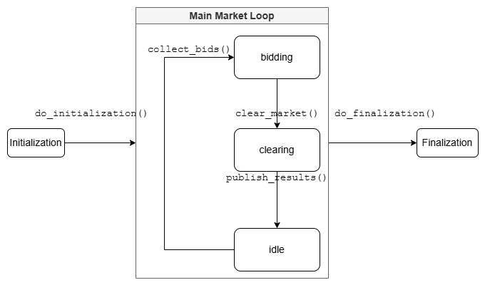

PySO is a EGRET-based energy market modeling tool developed by PNNL in the E-COMP LDRD initiative.

# Package Structure
## EnergyMarket
The `EnergyMarket` class is defined in `engine.py` and houses the core functionalities for running sequential energy market (Egret unit commitment) models.
It's core functionality is to move from one time window to the next.
Accounting for initial conditions, initializing enforced constraints etc. should be handled within this object.

The core input is a data provider which should be a subclass of the abstract `DataProvider` class.
This object must expose a method called `get_model` that takes a DatetimeIndex as input, and return an Egret `ModelData` object for the specified time range as output.

A trivial example is the [`EgretProvider`](./src/pyenergymarket/parsers/egretparser.py) that simple returns portions of an Egret model depending depending on the time range provided and the time keys in the model (which are assumed to be Timestamp parsable.)

## Market Class
The `Market` class is intended to capture the various stages of a market and allow interaction with the operation during these states.
It is built onto of the `transitions` package as a state machine.

The basic structure is:<br>


The market states are:
* bidding
* clearing
* idle

Additional ones can be added.
The following callbacks functions are defined as abstract methods:

|method | place in state machine |
|:------|:-----------------------|
|`collect_bids` | entering the `bidding` state|
|`clear_market` | entering the `clearing` state|
|`publish_results`| exiting the `clearing` state|
|`do_initialization`| exiting the `initialization` state|
|`do_finalization`| entering the `finalization` state|

## MarketTiming Class
The market time class is use to define the iterations of the `Market` class.
It requires the following information:
* market interval: the duration of one iteration
* timing: a list of dictionary for each of the market states containing:
    - name : the name of the state
    - `start_time`: the starting time in the market iteration.
* `time_unit`: "hour", "W", etc. (see Timedelta unit argument) this is optional depending on the type of input for the market interval and start times.

Time inputs can be provided in two ways:
* Integers (with units)
* pandas Timedelta objects.

The following two examples are equivalent:
```python
import pandas as pd
mt_int = {
    "market_interval": 24,
    "time_unit": "hour",
    "timing": [
        {"name": "clearing",
        "start_time": 0 },
        {"name": "idle",
        "start_time": 3},
        {"name": "bidding",
        "start_time": 21}
    ]
}

mt = {
    "market_interval": pd.Timedelta(24, unit="h"),
    "timing": [
        {"name": "clearing",
        "start_time": pd.Timedelta(0, unit="h") },
        {"name": "idle",
        "start_time": pd.Timedelta(3, unit="h")},
        {"name": "bidding",
        "start_time": pd.Timedelta(21, unit="h")}
    ]
}
```

Internally, the `MarketTiming` class converts everything to Timedelta.

## Basic Usage
The market class has a property called `current_time` which can be set with a pandas `Timestamp`.
Setting this time drives the `Market` forward. 
Based on the `MarketTiming` class, the `Market` always knows when the next state should be transitioned to (`next_state_time` property).
As long as the set `current_time` is greater than or equal to `next_state_time` the state machine will continue changing states and the related callbacks called.
The expectation is therefore that the market will be driven in some sort of a loop like the following:

```python
for t in market.market_loop():
    market.current_time = t
```

>**NOTE:**<br>
>The `market_loop` method is a utility that iterates through the times of the market until the final state is reached.
>It just one way to generate time for the market.
>Any valid timestamps, however generated, will do.


# Setup
## Installing Egret
The package allows you to use different sources for the Egret dependency based on your needs.

### NAERM Project (Default for CI)
If you're part of the NAERM project, you can install with the NAERM-specific Egret:

```bash
pip install -e ".[naerm]"
```

This will install Egret from the NAERM GitLab repository.

### Standard Egret
If you're not part of the NAERM project or need the standard Egret version:

```bash
pip install -e ".[standard]"
```

This will install Egret from the official Grid Parity Exchange repository.

### Manual Installation
Alternatively, you can manually install Egret. The repository needs to be cloned and then installed via pip in edit mode.

In all cases, make sure to [install a solver](#solvers)

## Developer Setup

### Installing Development Dependencies

To set up the development environment with all necessary tools for linting and type checking:

```bash
# Install the package in development mode with dev dependencies
pip install -e ".[dev]"
```

This will install development tools including:
- pre-commit (for Git hooks)
- ruff (for linting)
- mypy (for type checking)
- pandas-stubs, types-networkx and other type stub packages

### Setting Up Pre-commit Hooks

Pre-commit hooks ensure that code quality checks run before each commit, preventing common issues from being committed:

```bash
# Install the pre-commit hooks
pre-commit install
```

This will set up Git hooks to automatically run:
- Trailing whitespace removal
- End-of-file fixer
- YAML and TOML syntax checkers
- Ruff linting and formatting
- Mypy type checking

### Running Type Checking Manually

To run type checking manually:

```bash
# Run mypy on the entire codebase
python -m mypy src

# Run mypy on a specific file
python -m mypy src/pyenergymarket/utils/timeutils.py
```

### Known Issues
There are some issues that arise when the `pandas`, `blosc` and `tables` (pytables) are not installed from the same channel as the latter two are optional dependencies of pandas for reading form sources like hdf5 and excel.
If there are `ImportError` issues, the solution is to uninstall these and make sure to install them all from the same location.
One option, would be to uninstall them and pandas and do something like:
```
pip install "pandas[hdf5, excel]"
```

## Solvers
### Installing CBC on Windows
Cbc installation appears to be not very supported on windows.
The following appears to work for getting the installation working.

#### Python environment
For this example a `conda` environment is assumed.
There are other ways to work with python environments, with some modification potentially necessary.

#### Get the Binaries
The CBC binaries can be downloaded from [here](https://www.coin-or.org/download/binary/Cbc/?C=M;O=D).
Download one for win64.

This will download a zip file to your computer. For example:
```
Cbc-master-win64-msvc15-mtd.zip
```

Extract the zip files.

Under the created folder structure navigate to `bin`

There should be three `.exe` files located there:
* `cbc.exe`
* `clp.exe`
* `glpsol.exe`

#### Copy to Python Environment

The three `.exe` binaries need to now be copied to the `bin` folder of your Python environment.
This should be located at:
```
<Your-Anacond/Minicond-Installation-Folder>/envs/<environment-name>/Library/bin
```
### Installing SCIP
[SCIP](https://www.scipopt.org/index.php#download) is a high-performance open source MIP solver.
To install it simply run:
```
conda install scip -c conda-forge
```
The repository is [here](https://github.com/conda-forge/scipoptsuite-feedstock)

>**NOTE**:
>This is here for historical reasons, as runs with scip were attempted.
>Currently, Egret does not seem to work particularly well with SCIP.

### IPOPT
There appears to be an issue with ipopt versions `>3.11` that the `ipopt.exe` is no longer included when installing (at least via conda).
See [this issue](https://github.com/conda-forge/ipopt-feedstock/issues/55).
As a result, if ipopt, say version 3.14 (latest at the time of writing) is used, then pyomo (which requires the `ipopt.exe` binary apparently) errors, stating that the application could not be found.

A solution to this is to install version 3.11:
```
conda install ipopt=3.11 -c conda-forge
```

>*Note*:<br>
>Ipopt is installed along with scip, so if you are installing scip it may be better to install this first, otherwise there appear to be dependency issues.

### Verify Installation
In the command line run:
```
(scuc-der)> pyomo help --solvers

Pyomo Solvers and Solver Managers
---------------------------------
Pyomo uses 'solver managers' to execute 'solvers' that perform
[...]

Serial Solver Interfaces
------------------------
The serial manager supports the following solver interfaces:
[...]
    +cbc                 0.0       The CBC LP/MIP solver
[...]
```
The `(+)` sign next to `cbc` (or any other solver) indicates that the solver was found.
If there is no sign, it means that something didn't work.
